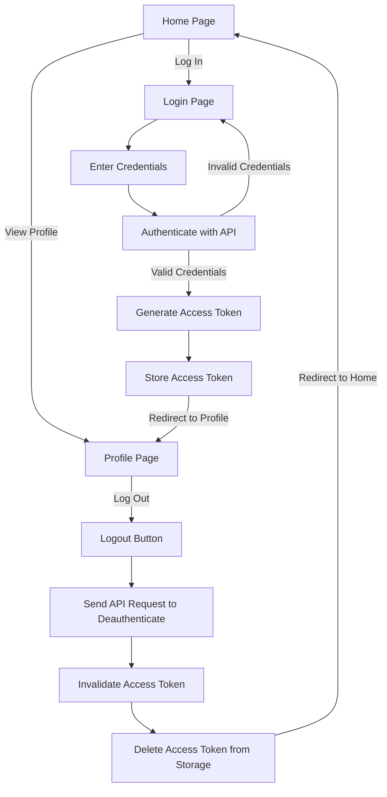

# Auth0 React

This project is a implementation of authentication using Auth0 in React + Vite. The project aims to provide a comprehensive documentation of the project's implementation details, objectives, key features, technologies used, project structure, and implementation details.


You can view the live website [here](https://auth0-react-b5e35.web.app). 

## Main Objective/s

The main objective of this project is to build a user authentication system using Auth0 in React + Vite. The project aims to provide a comprehensive documentation of the project's implementation details, objectives, key features, technologies used, project structure, and implementation details.

## Workflow Diagram



## Key Feature/s

The Auth0 React project provides the following key features:

- Sign Up: Allows users to sign up in the web application using their email and password or third-party providers.
- Sign In: Allows users to sign in to the web application using their email and password.
- Profile Page: Allows users to view their personal information such as their first name, last name, email and much more!.
- Sign Out: Allows users to sign out of the web application and remove the access token stored in the cookies..

## What I've Learned

Through this project, I gained the following knowledge and skills:

- Learned how to create a design workflow of the web application.
- Customize my own universal login page in Auth0.
- Learned how authentication works by using JWT.
- Importance of using providers in stateless authentication.

## Quick Installation

1. Clone the repository to your local machine by running the following command in your terminal or command prompt:

   `git clone https://github.com/your-user-name/your-repo-name.git`

   Replace `your-user-name` and `your-repo-name` with your [GitHub username](poe://www.poe.com/_api/key_phrase?phrase=GitHub%20username&prompt=Tell%20me%20more%20about%20GitHub%20username.) and the name of your repository.

2. Navigate to the project directory by running the following command in your terminal or command prompt:

   ```cd your-repo-name```
   Replace `your-repo-name` with the name of your repository.

3. Install the dependencies by running the following command in your terminal or command prompt:

   ```npm install```

   This will install all the necessary packages and dependencies required to run the project.

4. Rename the .env.example file to .env and add your Auth0 credentials to the file. You can find your Auth0 credentials in the "Settings" tab of your Auth0 application dashboard.

5. Start the development server by running the following command in your terminal or command prompt:

   ```npm run dev```

   This will start the development server and compile the project files. You should see a message similar to `Server running at http://localhost:5173` in your terminal or command prompt.

   Open your web browser and navigate to http://localhost:5173 to view the website.

   You should see the home page of the Auth0 React project. You can now start making changes to the project and see the changes reflected in your web browser.

## Contributions

Contributions are welcome! If you want to contribute to the project, please follow these guidelines:

1. Fork the repository to your own GitHub account.

2. Clone the repository to your local machine:

   `git clone https://github.com/MiDo-kun/Auth0-React.git`

3. Create a new branch for your changes:

   `git checkout -b your-branch-name`

4. Make your changes to the code.

5. Commit your changes:

   `git commit -m "Your commit message"`

6. Push your changes to your fork:

   `git push origin your-branch-name`

7. Create a pull request from your fork to the main repository.

## License

This project is licensed under the MIT License. See the LICENSE file for more information.
